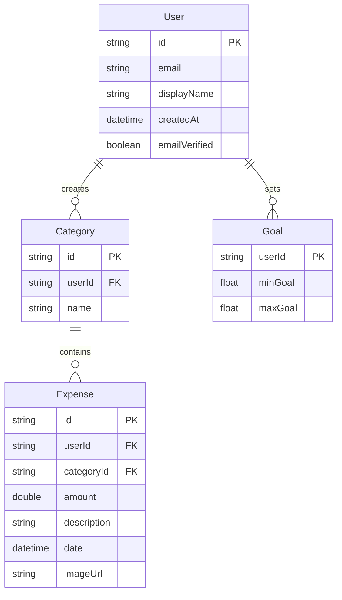

# Smart Budgeting 2.0 🏦💰

<div align="center">
  
  
  
  
  
  
</div>

## 📱 Take Control of Your Financial Future

*Smart Budgeting 2.0* is an advanced personal finance management application designed specifically for South Africans who want to master their money. Built with cutting-edge Android technology, it provides intelligent expense tracking, comprehensive budgeting tools, and actionable financial insights - all wrapped in an intuitive, mobile-first experience.

Perfect for students managing their allowances, professionals optimizing their salaries, and families planning for their future.

---

## ✨ Key Features

### 🔐 Secure Authentication
- **Firebase-powered login** with email verification and password recovery

### 🏷 Custom Category Management
- **Easily create your own expense categories** for personalized budgeting

### 💰 Simple Expense Tracking
- **Add expenses with ease** and assign them to categories
- **Upload receipts** directly from your gallery for recordkeeping

### 🎯 Goal-Oriented Budgeting
- **Set monthly spending goals** and track your progress
- **Visual budget indicators** show if you're below, within, or over your target

### 📊 Insightful Reports & Analytics
- **Monthly spending summary** with min/max budget tracking
- **Progress tracker** displays spending and days left in the month
- **Bar graph** breaks down expenses by category, with visual goal lines for min/max targets

### 📱 User-Friendly Mobile Experience
- **Offline support** so you can budget anytime, anywhere
- **Achievement badges** to celebrate your budgeting milestones


---

## 🎯 Core Benefits

| Benefit | Impact |
|---------|--------|
| 💵 *Better Money Awareness* | Track exactly where your money goes with categorized expenses and monthly summaries |
| 🎯 *Reach Your Budget Goals* | Stay on target with visual progress indicators and min/max budget tracking |
| 🧠 *More Control, Less Stress* | Know if you're within budget at a glance and avoid overspending surprises |
| 📱 *Accessible Anywhere* | Budget anytime—even offline—with a mobile-first experience |
| 🔒 *Secure by Design* | Keep your data safe with Firebase authentication and local storage support |
| 🏆 *Stay Motivated* | Earn badges for good budgeting behavior and stay engaged with your progress |


---

## 🎥 App Showcase

### 📒 Expense Tracking Interface
Quick expense entry with budget monitoring and recent expenses view

### 🗂️ Category Management
Organize expenses with custom categories and real-time totals

### 📊 Analytics Dashboard
Visual spending breakdown with interactive pie charts and budget usage

> 🎬 [Watch Full Demo Video](https://youtu.be/7H_umG7AAS0) – See all features in action!

---

## 👨‍💻 Development Team

<table>
  <tr>
    <td align="center">
      <br />
      <sub><b>Cristiano</b></sub><br />
      <sub>ST10254797</sub><br />
      <sub>🚀 Project Lead & Architecture</sub>
    </td>
    <td align="center">
      <br />
      <sub><b>Ryan</b></sub><br />
      <sub>ST10377479</sub><br />
      <sub>💻 Full Stack Development</sub>
    </td>
    <td align="center">
      <br />
      <sub><b>Ethan</b></sub><br />
      <sub>ST10279132</sub><br />
      <sub>🔧 Backend & Integration</sub>
    </td>
  </tr>
</table>

---

## 🛠 Technology Stack

### Frontend Development
```kotlin
// Modern Android Development
- Kotlin 100%
- Jetpack Compose UI
- Material Design 3
- Navigation Component
- ViewBinding & DataBinding
- Custom Animations
- Gallery Photo Upload

```

### Backend & Data
```kotlin
// Robust Data Management
- Firebase Authentication
- Kotlin Coroutines
- Flow & LiveData
- Repository Pattern
- WorkManager
```

### Third-Party Integrations
```gradle
// Enhanced Functionality
- MPAndroidChart for visualizations
- Glide for image loading
- ML Kit for OCR
```

---

## ⚙ Technical Architecture

### Database Schema


### App Architecture (MVVM)

```
┌─────────────────┐    ┌─────────────────┐    ┌─────────────────┐
│   UI Layer      │    │  Domain Layer   │    │   Data Layer    │
│                 │    │                 │    │                 │
│ • Activities    │◄──►│ • ViewModels    │◄──►│ • Repositories  │
│ • Fragments     │    │ • Use Cases     │    │ • Data Sources  │
│ • Compose UI    │    │ • State Holders │    │ • Database      │
└─────────────────┘    └─────────────────┘    └─────────────────┘
```

---

## 📂 Project Structure

```
smart-budgeting-2.0/
├── 📱 app/
│   ├── src/main/java/com/s100254797/smartbudgetting20/
│   │   ├── � ui/
│   │   │   ├── auth/
│   │   │   │   ├── SignInActivity.kt
│   │   │   │   └── SignUpActivity.kt
│   │   │   ├── dashboard/
│   │   │   │   ├── MainActivity.kt
│   │   │   │   └── BalanceOverviewActivity.kt
│   │   │   ├── expenses/
│   │   │   │   ├── ExpenseActivity.txt
│   │   │   │   └── CategoryActivity.kt
│   │   │   ├── goals/
│   │   │   │   └── GoBSetImageActivity.kt
│   │   │   ├── analytics/
│   │   │   │   └── CategoryGraphActivity.kt
│   │   │   ├── achievements/
│   │   │   │   └── BadgesActivity.kt
│   │   │   └── components/
│   │   ├── 💾 data/
│   │   │   ├── models/
│   │   │   │   ├── Badge.kt
│   │   │   │   ├── Category.kt
│   │   │   │   └── Goal.kt
│   │   │   ├── repository/
│   │   │   │   ├── BadgeRepository.kt
│   │   │   │   └── FirestoreRepository.kt
│   │   │   └── remote/
│   │   │       └── (Firebase integration)
│   │   ├── 🧠 domain/
│   │   │   ├── models/
│   │   │   ├── repository/
│   │   │   └── usecases/
│   │   ├── 🔧 utils/
│   │   │   ├── BadgeUtils.txt
│   │   │   ├── Extensions.kt
│   │   │   └── (other utilities)
│   │   ├── 🏗 di/
│   │   └── adapters/
│   │       ├── BadgeAdapter.kt
│   │       └── ExpenseAdapter.kt
│   └── src/main/res/
│       ├── layout/                # All XML layouts
│       ├── drawable/              # Images & vectors
│       ├── values/                # Colors, strings, styles
│       ├── menu/                  # Menu resources
│       ├── mipmap/                # App icons
│       └── xml/                   # Other XML resources
├── manifests/
│   └── AndroidManifest.xml
└── (test directories)
```

---

## 🚀 Getting Started

### Prerequisites
- *Android Studio* Hedgehog (2023.1.1) or newer
- *JDK 11* or higher
- *Android SDK 33* or higher
- *Minimum Android 7.0* (API level 24)
- *Firebase Account* (for authentication)
- *Git* (for version control)

### Quick Setup

1. *Clone the Repository*
   ```bash
   git clone https://github.com/ST10254797/SmartBudgettings2.0.git
   cd SmartBudgettings2.0
   ```

2. *Open in Android Studio*
   ```
   File → Open → Select project folder → Wait for Gradle sync
   ```

3. *Configure Firebase*
   ```bash
   # 1. Create Firebase project at console.firebase.google.com
   # 2. Add Android app with package: com.smartbudget.app
   # 3. Download google-services.json
   # 4. Place in app/ directory
   # 5. Enable Email/Password authentication
   ```

4. *Build & Run*
   ```bash
   # Connect device or start emulator
   # Click Run button (▶) in Android Studio
   # Or use command line:
   ./gradlew assembleDebug
   ```

### Demo Credentials

Email: Dan@gmail.com
Password: Dan@123

> 🎬 [Full Feature Walkthrough](https://youtu.be/7H_umG7AAS0) - Complete app demonstration.

---

## 📚 User Guide

1. *Create Your Account*  
   - Launch Smart Budgeting 2.0  
   - Tap **Get Started** and register with your email  
   - Verify your email address to activate your account  

2. *Personalize Your Budgeting*  
   - Add your custom expense categories  
   - Set your minimum and maximum budget goals  

3. *Start Tracking Expenses*  
   - Add new expenses and attach photos from your gallery if needed  
   - Monitor your spending and budget progress in real time  
   - Receive warnings if you are below, within, or above your budget  

### 💡 Daily Usage

#### Recording Expenses

📱 Quick Entry:  
1. Tap the **Add Expense** floating action button  
2. Enter expense amount in the **Amount** field  
3. Add description in the **Description** field  
4. Select date using the date picker  
5. Choose category from dropdown (e.g., "Food")  
6. Optionally upload receipt photo from your gallery  
7. Tap **Save** to record the expense  

#### Budget Monitoring

📊 Stay on Track:  
1. View budget status banner at the top of Expense Tracker  
2. Monitor notifications like **You're within your budget**  
3. Check budget usage progress in Balance Overview  
4. Review spending breakdown by category  

#### Managing Categories

🏷 Category Organization:  
1. Navigate to **Manage Categories** screen  
2. View existing categories with totals (e.g., Sports: R1000.00)  
3. See individual expenses within each category  
4. Add new categories using the text input field  
5. Use **Add Category** or **Delete Category** buttons as needed  
6. Tap **Refresh Categories** to update totals  

#### Analyzing Spending

📈 Get Insights:  
1. Navigate to **Balance Overview** screen  
2. View **Expense Distribution** pie chart  
3. See percentage breakdown by category (e.g., Test: 38.7%, Sports: 33.0%, Rent: 28.3%)  
4. Monitor budget usage with progress indicators  
5. Use date filters to view specific time periods  

### Quality Assurance
- *Automated CI/CD*: GitHub Actions run builds and tests on each commit
- *Security Scans*: Regular checks for dependencies and vulnerabilities

---

## 🔒 Privacy & Security

- 🔐 *End-to-end encryption* for sensitive financial data
- ☁️ *Cloud storage* fully managed by Firebase
- 🛡 *No data selling* - your financial privacy is guaranteed
- ✅ *POPIA compliant* - follows South African data protection laws
- 🔒 *Firebase Security Rules* enforce data access control


---

## 🌍 Localization

### 🇿🇦 South African Relevance

- 💰 **ZAR Currency** as the default for all budgeting and expense tracking
- 🏷 **Localized Categories** like Food, Transport, and Rent tailored to common SA expenses
- 📶 **Data-Conscious Design** to support users with limited connectivity
- ☁️ **Firebase-Backed Storage** for real-time sync and secure cloud access

---

## 🚀 Roadmap

### Version 2.1 (Q3 2025)
- [ ] 📦 Firebase export/import improvements
- [ ] 🔔 Custom budget alerts
- [ ] 📅 Weekly/monthly insights summaries
- [ ] 🌙 Dark mode support

### Version 2.2 (Q4 2025)
- [ ] 🛠 Category-based budget recommendations
- [ ] 📊 Enhanced pie chart filtering
- [ ] 🧾 Bulk expense entry
- [ ] 🌍 Language & regional settings

### Version 3.0 (Q1 2026)
- [ ] 🧠 Smart recurring expense detection
- [ ] 📥 Offline expense queuing (sync later)
- [ ] 🗂 Archive old months’ budgets
- [ ] 🔄 Auto-refresh dashboard widgets

---

## 🤝 Contributing

We welcome contributions from the community! Here's how you can help:

### Development Setup
```bash
# Fork the repository
git fork https://github.com/ST10254797/SmartBudgettings2.0.git

# Create feature branch
git checkout -b feature/amazing-feature

# Make changes and commit
git commit -m "Add amazing feature"

# Push to branch
git push origin feature/amazing-feature

# Create Pull Request
```

### Ways to Contribute
- 🐛 *Bug Reports*: Found an issue? Let us know!
- 💡 *Feature Requests*: Have ideas? We'd love to hear them!
- 🔧 *Code Contributions*: Help us build new features
- 📝 *Documentation*: Improve our guides and docs
- 🌍 *Translations*: Help localize for other regions
- 🧪 *Testing*: Help us test on different devices

---

## 📞 Support & Feedback

### 📬 Get Help
- 🐛 *Bug Reports*: [GitHub Issues](https://github.com/ST10254797/SmartBudgettings2.0/issues)

---

## 📄 License

This project is licensed under the MIT License - see the [LICENSE](LICENSE) file for details.

```
MIT License

Copyright (c) 2025 Smart Budgeting Team

Permission is hereby granted, free of charge, to any person obtaining a copy
of this software and associated documentation files (the "Software"), to deal
in the Software without restriction, including without limitation the rights
to use, copy, modify, merge, publish, distribute, sublicense, and/or sell
copies of the Software...
```

---

## 🙏 Acknowledgments

- 🏫 *Varsity College* for project support and guidance
- 🔥 *Firebase Team* for excellent backend services  
- ☕ *Coffee Shops of Durban* for providing coding fuel

---

## 📊 Project Stats


---

<div align="center">

### 🌟 Star this repository if Smart Budgeting 2.0 helped you manage your finances better!

*Built with ❤ in South Africa 🇿🇦*

Making financial wellness accessible to everyone

</div>
